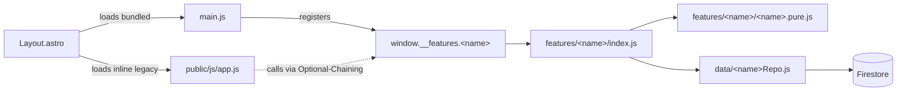

# src/scripts — Modulares v6-Bundle

Hier wohnt der schrittweise extrahierte Code aus dem ehemals 3434-Zeilen-
Monolith `public/js/app.js` (aktuell ~2950 Zeilen, schrumpft mit jedem
Feature-Refactor weiter). Das Ziel von v6 ist, Feature für Feature in
saubere Module zu zerlegen, ohne dass die App zwischendurch unbenutzbar
wird.

Jedes Feature folgt demselben Muster, dem **Bridge-Pattern**, das wir mit
dem Pilot-Modul `presence/` etabliert haben.

## Verzeichnis-Layout

```
src/scripts/
  core/                  # querschnittliche Module (kein Domain-Feature)
    notifications/       # FCM (Web + Native), Token-Verwaltung
      index.js
      webToken.js
      nativeToken.js
  data/                  # Repository-Layer (kapselt Firestore-Pfade)
    userRepo.js
    bulletinRepo.js
    fcmTokenRepo.js
  features/              # Domain-Module
    presence/            # PILOT - Online-Anzeige + Heartbeat
      index.js
      presence.pure.js
    bulletin/            # Schwarzes Brett
      index.js
      bulletin.pure.js
  ui/                    # Toasts, Modals, Image-Viewer (später)
  main.js                # Bootstrap-Bundle, registriert window.__features.*
```

## Bridge-Pattern

Der Monolith `public/js/app.js` lädt synchron im Body, das v6-Modul-Bundle
läuft als ES-Module (defer via `<script>` in [src/layouts/Layout.astro](../layouts/Layout.astro)).



Aufrufe vom Monolithen gehen ausschliesslich durch:

```javascript
window.__features?.<name>?.<method>(...)
```

Das Optional-Chaining sorgt für graceful degradation: wenn das Bundle
nicht geladen wäre (z.B. Build-Fehler), crasht die App nicht — das Feature
ist nur still.

## Repository-Pattern

Alle Firestore-Zugriffe eines Features laufen über genau **einen** Repository
in `src/scripts/data/<name>Repo.js`. Der Pfad zur Collection wird in genau
einer Funktion bestimmt:

```javascript
function usersCollection() {
    return window.firebase.firestore().collection('users');
    // Multi-Tenant-Zukunft: collection('tenants').doc(TENANT_ID).collection('users')
}
```

Damit ist der Tenant-Switch eine Single-File-Änderung pro Repository.

## Pure vs. Impure

- **`<name>.pure.js`**: Reine Funktionen + Konstanten, **keine** DOM-, Firebase-,
  Timer- oder Zufallszugriffe. Isoliert testbar mit Vitest, schnell.
- **`index.js`**: Lifecycle, DOM, Repo-Aufrufe, Timer, Listener.

Diese Trennung hat den Pilot-Test `tests/unit/presence.test.js` (11 Tests
nur gegen die Pure-Helper) ermöglicht.

## Definition of Done — Modul-Migration-Checkliste

Für jedes weitere Modul vor dem Merge nach `release/v6.0.0`:

- [ ] Neuer Ordner `src/scripts/features/<name>/` mit `index.js` und ggf. `<name>.pure.js`
- [ ] Repository unter `src/scripts/data/<name>Repo.js` (falls Firestore-Zugriff)
- [ ] Bridge in `src/scripts/main.js` registriert `window.__features.<name>`
- [ ] Alte Implementierung aus `public/js/app.js` entfernt (Zeilen gezählt im Commit)
- [ ] Aufrufstellen im Monolithen via `window.__features?.<name>?.*` ersetzt
- [ ] Unit-Tests `tests/unit/<name>.test.js` (Pure-Helper)
- [ ] Unit-Tests `tests/unit/<name>Repo.test.js` (Repo mit window.firebase Stub)
- [ ] Unit-Tests `tests/unit/<name>Feature.test.js` (Lifecycle + Rendering, happy-dom)
- [ ] E2E `tests/e2e/<name>.spec.js` (mindestens 1 Happy-Path-Test, idealerweise 2-3)
- [ ] `npm run test` grün
- [ ] `npm run test:e2e` grün (lokal vor Push)
- [ ] `npm run build` lokal ohne Fehler/Warnings
- [ ] Smoke-Test mit `npm run dev`: Feature-UI funktioniert wie vorher
- [ ] CI auf `release/v6.0.0` grün (test.yml läuft automatisch)
- [ ] Commits sauber strukturiert:
    - `chore(<name>):` Vorbereitungen
    - `refactor(<name>):` Extraktion + Monolith-Cleanup
    - `test(<name>):` Unit + E2E
    - `build(<name>):` docs/ Output

## Modul-Status

| Phase     | Modul                | Status     | Bemerkung                                                                 |
| --------- | -------------------- | ---------- | ------------------------------------------------------------------------- |
| 1 (Pilot) | `presence/`          | migriert   | Online-Anzeige + Heartbeat, voll getestet                                 |
| 2         | `bulletin/`          | migriert   | Schwarzes Brett (Liste, Preview, Badge, Stats-Detail)                     |
| 2         | `core/notifications/`| migriert   | FCM-Token (Web + Native), orthogonal zum Bulletin-Modul                   |
| 3         | `streckenliste/`     | offen      | Grösster Hebel (Excel-Export, Foto-Upload) — Repo wird ausgereift          |
| 4         | `schonzeit/`         | offen      | Reine Logik + Pure-Helper, kein Firestore — sehr schnell                  |
| 5         | `wetter/`            | offen      | API-Layer + UI                                                            |
| 6         | `dokumente/`         | offen      | Storage-Integration, Wizard-Flow                                          |
| 7         | `map/`               | offen      | Leaflet + GPS, grösster Umfang                                            |
| 8         | `auth/` + `core/`    | offen      | Ganz zum Schluss — `app.js` wird auf Bootstrap reduziert                  |

## Bekannte Einschränkungen / TODOs

- `public/js/lib/pure.js` enthält noch die nicht-presence-Pure-Helper
  (`parseJagdzeit`, `istSchonzeit`, `getJagdzeitDatum`, `compressImage`).
  Diese ziehen mit den jeweiligen Modulen um.
- `window.firebase` (Compat-SDK) wird vom Monolithen erwartet — der wechsel
  auf modulares Firebase v9+ ist erst sinnvoll, wenn der Monolith vollständig
  weg ist.
- Capacitor-Hooks (`App.addListener`) duplizieren sich potenziell zwischen
  Modulen — falls mehr als 1 Modul sie braucht, in `core/` zentralisieren.
